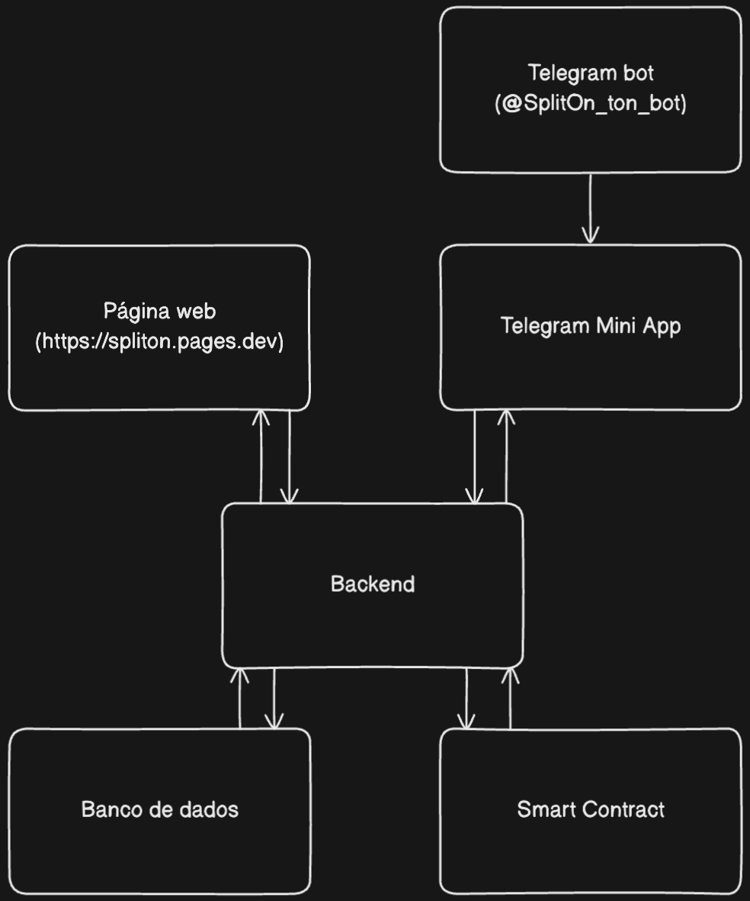

# SplitOn
**Hack-a-TON - Divisão Inteligente de Despesas na Blockchain TON**

## 🎯 Sobre o Projeto

SplitOn é uma aplicação descentralizada para divisão de despesas de maneira facilitada construída na blockchain TON. Permite que usuários criem grupos, adicionem despesas compartilhadas e realizem pagamentos diretos em TON, tudo de forma transparente e segura.

### 📲 Como acessar o projeto

Inicie uma conversa com o bot no Telegram:
```
https://t.me/splitOn_ton_bot
```
ou
Acesse a interface web:
```
https://spliton.pages.dev
```

## 😀 Fluxo de uso

 </img>

## ✨ Features Principais

- 🔐 **Autenticação via carteira TON** - Login seguro e descentralizado
- 👥 **Gerenciamento de grupos** - Crie e gerencie grupos de despesas
- 💰 **Divisão automática** - Calcule automaticamente quem deve quanto
- 🏦 **Pagamentos on-chain** - Transações diretas em TON
- 📱 **Interface responsiva** - Funciona em desktop e mobile
- 🤖 **Bot do Telegram** - Acesso rápido via Telegram
- 📊 **Histórico completo** - Visualize todas as transações
- ⚡ **Notificações** - Receba alertas de despesas e pagamentos(Em breve)

## 🏗️ Arquitetura do Projeto

### **Arquitetura do software**
</img>

#### Fluxo da Arquitetura SplitOn

O usuário pode acessar a aplicação SplitOn através de duas formas distintas:

**i.** Por meio da interface web, onde a aplicação web realiza requisições HTTP para o backend, que por sua vez consulta o banco de dados PostgreSQL para recuperar e exibir as informações ao usuário. Quando o usuário executa qualquer ação dentro da aplicação, o backend processa a solicitação e atualiza os dados correspondentes no banco de dados. No caso de pagamentos, o usuário interage diretamente com o smart contract através do TON Connect, e todas as informações das transações blockchain são sincronizadas e persistidas no banco de dados pelo backend.

**ii.** Por meio do bot do Telegram, onde inicialmente o bot envia uma mensagem de boas-vindas ao usuário contendo um link para abrir o Mini App diretamente dentro do aplicativo Telegram. Uma vez que o Mini App é carregado, ele opera de forma idêntica à interface web, realizando as mesmas requisições para o backend, que busca as informações no banco de dados para apresentá-las ao usuário. Da mesma forma, quando o usuário executa ações através do Mini App, o backend processa essas solicitações e atualiza o banco de dados. Para pagamentos, o processo também é idêntico: o usuário executa transações através do smart contract via TON Connect, e o backend garante que todas as informações sejam devidamente registradas no banco de dados.

Ambos os fluxos de acesso convergem para o mesmo backend centralizado, assegurando consistência de dados e sincronização completa entre as diferentes interfaces de usuário, com todas as operações blockchain sendo persistidas no banco de dados para auditoria e controle.

### **Stack Tecnológica**

#### **Frontend**
- **React 18** + **TypeScript** - Interface moderna e tipada
- **Vite** - Build tool rápido
- **Tailwind CSS** - Estilização utilitária
- **Radix UI** - Componentes acessíveis
- **React Router** - Navegação SPA
- **TanStack Query** - Gerenciamento de estado do servidor

#### **Backend**
- **NestJS** - Framework Node.js robusto
- **Prisma ORM** - Banco de dados type-safe
- **PostgreSQL** - Banco de dados relacional
- **JWT** - Autenticação
- **Class Validator** - Validação de dados

#### **Blockchain**
- **TON Connect** - Integração com carteiras TON
- **Tact** - Smart contracts (futuro)
- **TON API** - Interação com blockchain

#### **Infraestrutura**
- **Docker** - Containerização
- **Railway** - Deploy automático
- **Cloudflare Pages** - Frontend hosting
- **PostgreSQL** - Banco de dados na nuvem

### **Estrutura de Pastas**

```
spliton/
├── 📁 frontend/                 # Aplicação React
│   ├── 📁 src/
│   │   ├── 📁 components/       # Componentes React
│   │   │   ├── 📁 modals/       # Modais (criar grupo, despesa, etc.)
│   │   │   └── 📁 ui/           # Componentes base (Radix UI)
│   │   ├── 📁 hooks/            # Custom hooks
│   │   ├── 📁 pages/            # Páginas da aplicação
│   │   ├── 📁 lib/              # Utilitários e API
│   │   └── 📁 config/           # Configurações (TON Connect)
│   ├── 📁 public/               # Assets estáticos
│   └── 📄 package.json
│
├── 📁 backend/                  # API NestJS
│   ├── 📁 src/
│   │   ├── 📁 user/             # Módulo de usuários
│   │   ├── 📁 group/            # Módulo de grupos
│   │   ├── 📁 expenses/         # Módulo de despesas
│   │   ├── 📁 payments/         # Módulo de pagamentos
│   │   ├── 📁 wallet/           # Módulo de carteira
│   │   └── 📁 prisma/           # Configuração do banco
│   ├── 📁 prisma/
│   │   ├── 📁 migrations/       # Migrações do banco
│   │   └── 📄 schema.prisma     # Schema do banco
│   └── 📄 package.json
│
├── 📁 telegramBot/              # Bot do Telegram
│   ├── 📄 bot.py                # Lógica do bot
│   └── 📄 requirements.txt
│
├── 📁 contract/                 # Smart contracts (futuro)
│   ├── 📁 contracts/
│   └── 📄 package.json
│
├── 📁 scripts/                  # Scripts de desenvolvimento
│   └── 📄 dev-local.sh          # Script para desenvolvimento local
│
├── 📄 docker-compose.yml        # Configuração Docker local
├── 📄 backend.toml              # Configuração Railway
└── 📄 README.md
```

## 🚀 Como Executar Localmente

### **Pré-requisitos**
- Docker Desktop instalado e rodando
- Node.js 18+ (para desenvolvimento)
- Git

### **Opção 1: Script Automático (Recomendado)**
```bash
# Clone o repositório
git clone https://github.com/seu-usuario/spliton.git
cd spliton

# Execute o script de desenvolvimento
./scripts/dev-local.sh
```

### **Opção 2: Comandos Manuais**
```bash
# Parar containers existentes
docker compose down

# Construir e iniciar
docker compose up -d --build

# Ver logs
docker compose logs -f backend
```

### **URLs de Acesso Local**
- **Frontend**: http://localhost:3000
- **Backend API**: http://localhost:3001
- **Banco PostgreSQL**: localhost:5432
- **Health Check**: http://localhost:3001/health

### **Comandos Úteis**
```bash
# Ver logs em tempo real
docker compose logs -f backend
docker compose logs -f postgres

# Reiniciar backend
docker compose restart backend

# Executar seed (dados de teste)
docker compose exec backend npm run db:seed

# Abrir Prisma Studio
docker compose exec backend npx prisma studio
```

## 🌐 Deploy

### **Railway (Backend + Banco)**
O backend é deployado automaticamente no Railway quando há push para a branch `main`.

**Configuração:**
- **Arquivo**: `backend.toml`
- **Dockerfile**: `backend/Dockerfile`
- **Banco**: PostgreSQL automático
- **URL**: Gerada automaticamente pelo Railway

### **Cloudflare Pages (Frontend)**
O frontend é deployado automaticamente no Cloudflare Pages.

**Configuração:**
- **Build Command**: `npm run build`
- **Output Directory**: `dist`
- **Framework**: Vite

### **Telegram Bot**
O bot do Telegram é deployado separadamente no Railway.

**Configuração:**
- **Arquivo**: `telegram-bot.toml`
- **Dockerfile**: `telegramBot/Dockerfile`

## 🔧 Desenvolvimento

### **Estrutura de Dockerfiles**

#### **Railway (Produção)**
- **Arquivo**: `backend/Dockerfile`
- **Contexto**: Raiz do projeto
- **Comando**: `COPY backend/ ./`
- **Seed**: Desabilitado (`--skip-seed`)

#### **Desenvolvimento Local**
- **Arquivo**: `backend/Dockerfile.local`
- **Contexto**: Pasta `backend/`
- **Comando**: `COPY . ./`
- **Seed**: Habilitado (opcional)

## 🔐 Autenticação

### **TON Connect**
- Integração com carteiras TON
- Login descentralizado
- Assinatura de transações

### **JWT Tokens**
- Tokens de sessão
- Refresh automático
- Validação de permissões

## 📝 Contribuição

1. Fork o projeto
2. Crie uma branch para sua feature
3. Commit suas mudanças
4. Push para a branch
5. Abra um Pull Request

## 📄 Licença

Este projeto está sob a licença MIT. Veja o arquivo [LICENSE](LICENSE) para mais detalhes.

## 🆘 Suporte

- **Issues**: [GitHub Issues](https://github.com/seu-usuario/spliton/issues)
- **Documentação**: Este README
- **Telegram**: [@spliton_bot](https://t.me/splitOn_ton_bot)

---

**SplitOn** - Divisão inteligente de despesas na blockchain TON 🚀
