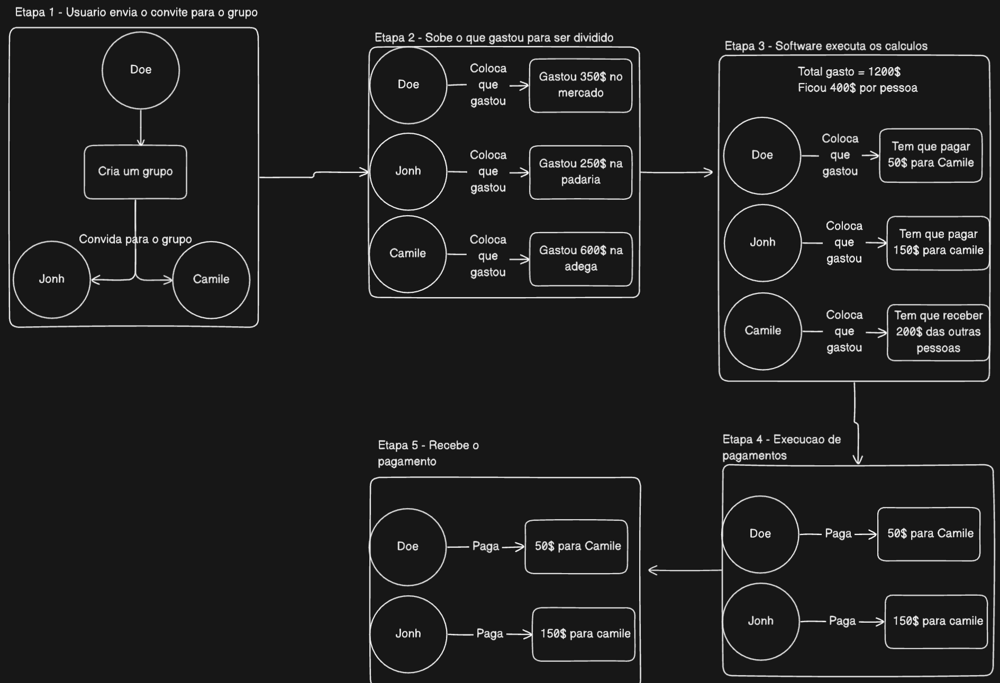

# SplitOn
**Hack-a-TON - Intelligent Expense Division on TON Blockchain**

## 📋 Table of Contents

- [🎯 About the Project](#-about-the-project)
- [📲 How to Access the Project](#-how-to-access-the-project)
- [😀 Usage Flow](#-usage-flow)
- [✨ Main Features](#-main-features)
- [🏗️ Project Architecture](#️-project-architecture)
  - [Software Architecture](#software-architecture)
  - [Technology Stack](#technology-stack)
  - [Folder Structure](#folder-structure)
- [🚀 How to Run Locally](#-how-to-run-locally)
  - [Prerequisites](#prerequisites)
  - [Option 1: Automatic Script](#option-1-automatic-script-recommended)
  - [Option 2: Manual Commands](#option-2-manual-commands)
  - [Local Access URLs](#local-access-urls)
  - [Useful Commands](#useful-commands)
- [🌐 Deployment](#-deployment)
  - [Backend + Database (Railway)](#backend--database-railway)
  - [Telegram Bot (Railway)](#telegram-bot-railway)
  - [Frontend (Cloudflare Pages)](#frontend-cloudflare-pages)
- [🔧 Development](#-development)
  - [Dockerfile Structure](#dockerfile-structure)
- [🔐 Authentication](#-authentication)
  - [TON Connect](#ton-connect)
  - [JWT Tokens](#jwt-tokens)
- [📝 Contributing](#-contributing)
- [📄 License](#-license)
- [🆘 Support](#-support)

---

## 🎯 About the Project

SplitOn is a decentralized application for intelligent expense division built on the TON blockchain. It allows users to create groups, add shared expenses, and make direct payments in TON, all in a transparent and secure manner.

### 📲 How to Access the Project

Start a conversation with the bot on Telegram:
```
https://t.me/splitOn_ton_bot
```
or
Access the web interface:
```
https://spliton.pages.dev
```

## 😀 Usage Flow

 </img>

## ✨ Main Features

- 🔐 **TON Wallet Authentication** - Secure and decentralized login
- 👥 **Group Management** - Create and manage expense groups
- 💰 **Automatic Division** - Automatically calculate who owes what
- 🏦 **On-chain Payments** - Direct transactions in TON
- 📱 **Responsive Interface** - Works on desktop and mobile
- 🤖 **Telegram Bot** - Quick access via Telegram
- 📊 **Complete History** - View all transactions
- ⚡ **Notifications** - Receive expense and payment alerts (Coming soon)

## 🏗️ Project Architecture

### **Software Architecture**
</img>

#### SplitOn Architecture Flow

Users can access the SplitOn application through two distinct ways:

**i.** Through the web interface, where the web application makes HTTP requests to the backend, which in turn queries the PostgreSQL database to retrieve and display information to the user. When the user performs any action within the application, the backend processes the request and updates the corresponding data in the database. In the case of payments, the user interacts directly with the smart contract through TON Connect, and all blockchain transaction information is synchronized and persisted in the database by the backend.

**ii.** Through the Telegram bot, where initially the bot sends a welcome message to the user containing a link to open the Mini App directly within the Telegram application. Once the Mini App is loaded, it operates identically to the web interface, making the same requests to the backend, which fetches information from the database to present to the user. Similarly, when the user performs actions through the Mini App, the backend processes these requests and updates the database. For payments, the process is also identical: the user executes transactions through the smart contract via TON Connect, and the backend ensures that all information is properly recorded in the database.

Both access flows converge to the same centralized backend, ensuring data consistency and complete synchronization between different user interfaces, with all blockchain operations being persisted in the database for auditing and control.

### **Technology Stack**

#### **Frontend**
- **React 18** + **TypeScript** - Modern and typed interface
- **Vite** - Fast build tool
- **Tailwind CSS** - Utility styling
- **Radix UI** - Accessible components
- **React Router** - SPA navigation
- **TanStack Query** - Server state management

#### **Backend**
- **NestJS** - Robust Node.js framework
- **Prisma ORM** - Type-safe database
- **PostgreSQL** - Relational database
- **JWT** - Authentication
- **Class Validator** - Data validation

#### **Blockchain**
- **TON Connect** - TON wallet integration
- **Tact** - Smart contracts (future)
- **TON API** - Blockchain interaction

#### **Infrastructure**
- **Docker** - Containerization
- **Railway** - Automatic deployment
- **Cloudflare Pages** - Frontend hosting
- **PostgreSQL** - Cloud database

### **Folder Structure**

```
spliton/
├── 📁 frontend/                 # React Application
│   ├── 📁 src/
│   │   ├── 📁 components/       # React Components
│   │   │   ├── 📁 modals/       # Modals (create group, expense, etc.)
│   │   │   └── 📁 ui/           # Base components (Radix UI)
│   │   ├── 📁 hooks/            # Custom hooks
│   │   ├── 📁 pages/            # Application pages
│   │   ├── 📁 lib/              # Utilities and API
│   │   └── 📁 config/           # Configurations (TON Connect)
│   ├── 📁 public/               # Static assets
│   └── 📄 package.json
│
├── 📁 backend/                  # NestJS API
│   ├── 📁 src/
│   │   ├── 📁 user/             # User module
│   │   ├── 📁 group/            # Group module
│   │   ├── 📁 expenses/         # Expenses module
│   │   ├── 📁 payments/         # Payments module
│   │   ├── 📁 wallet/           # Wallet module
│   │   └── 📁 prisma/           # Database configuration
│   ├── 📁 prisma/
│   │   ├── 📁 migrations/       # Database migrations
│   │   └── 📄 schema.prisma     # Database schema
│   └── 📄 package.json
│
├── 📁 telegramBot/              # Telegram Bot
│   ├── 📄 bot.py                # Bot logic
│   └── 📄 requirements.txt
│
├── 📁 contract/                 # Smart contracts (future)
│   ├── 📁 contracts/
│   └── 📄 package.json
│
├── 📁 scripts/                  # Development scripts
│   └── 📄 dev-local.sh          # Script for local development
│
├── 📄 docker-compose.yml        # Local Docker configuration
├── 📄 backend.toml              # Railway configuration
└── 📄 README.md
```

## 🚀 How to Run Locally

### **Prerequisites**
- Docker Desktop installed and running
- Node.js 18+ (for development)
- Git

### **Option 1: Automatic Script (Recommended)**
```bash
# Clone the repository
git clone https://github.com/your-username/spliton.git
cd spliton

# Run the development script
./scripts/dev-local.sh
```

### **Option 2: Manual Commands**
```bash
# Stop existing containers
docker compose down

# Build and start
docker compose up -d --build

# View logs
docker compose logs -f backend
```

### **Local Access URLs**
- **Frontend**: http://localhost:8080
- **Backend API**: http://localhost:3000
- **PostgreSQL Database**: localhost:5432
- **Health Check**: http://localhost:3000/health

### **Useful Commands**
```bash
# View real-time logs
docker compose logs -f backend
docker compose logs -f postgres

# Restart backend
docker compose restart backend

# Run seed (test data)
docker compose exec backend npm run db:seed

# Open Prisma Studio
docker compose exec backend npx prisma studio
```

## 🌐 Deployment

### **Backend + Database (Railway)**
The backend is automatically deployed on Railway when there's a push to the `main` branch.

**Configuration:**
- **File**: `backend.toml`
- **Dockerfile**: `backend/Dockerfile`
- **Database**: PostgreSQL

### **Telegram Bot (Railway)**
The Telegram bot is deployed separately on Railway.

**Configuration:**
- **File**: `telegram-bot.toml`
- **Dockerfile**: `telegramBot/Dockerfile`

### **Frontend (Cloudflare Pages)**
The frontend is automatically deployed on Cloudflare Pages.

**Configuration:**
- **Build Command**: `npm run build`
- **Output Directory**: `dist`
- **Framework**: Vite

## 🔧 Development

### **Dockerfile Structure**

#### **Railway (Production)**
- **File**: `backend/Dockerfile`
- **Context**: Project root
- **Command**: `COPY backend/ ./`
- **Seed**: Disabled (`--skip-seed`)

#### **Local Development**
- **File**: `backend/Dockerfile.local`
- **Context**: `backend/` folder
- **Command**: `COPY . ./`
- **Seed**: Enabled (optional)

## 🔐 Authentication

### **TON Connect**
- TON wallet integration
- Decentralized login
- Transaction signing

### **JWT Tokens**
- Session tokens
- Automatic refresh
- Permission validation

## 📝 Contributing

1. Fork the project
2. Create a branch for your feature
3. Commit your changes
4. Push to the branch
5. Open a Pull Request

## 📄 License

This project is under the MIT license. See the [LICENSE](LICENSE) file for more details.

## 🆘 Support

- **Issues**: [GitHub Issues](https://github.com/your-username/spliton/issues)
- **Documentation**: This README
- **Telegram**: [@spliton_bot](https://t.me/splitOn_ton_bot)

---

[⬆️ Back to top](#spliton)

**SplitOn** - Intelligent expense division on TON blockchain 🚀 